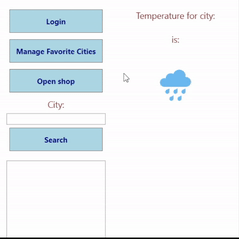
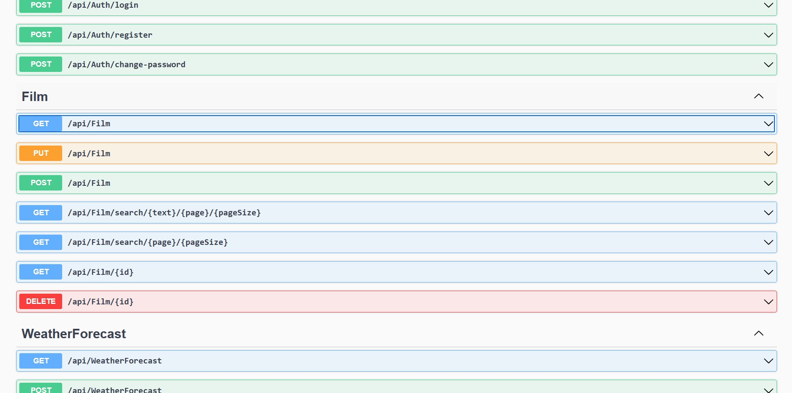
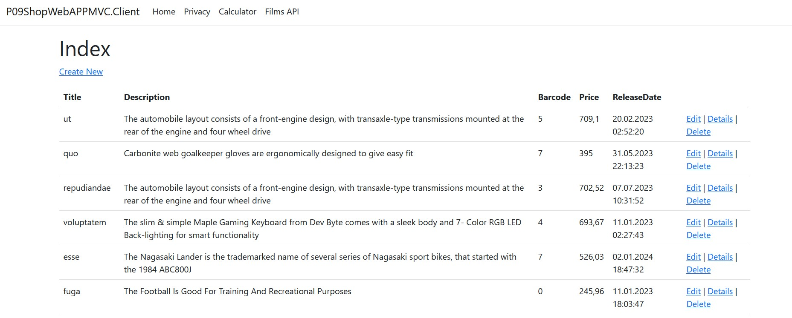
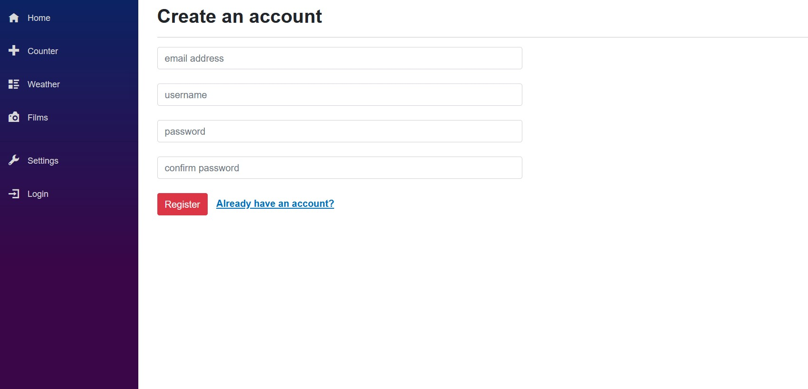
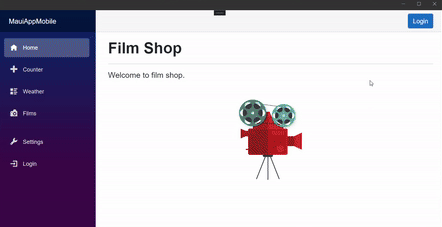

## Pamiw

This repository is a collection of various C# applications designed for multiple platforms including Desktop WPF, APIs, Web applications (normal and MVC), Blazor WebAssembly, and MAUI. These applications interact with APIs for basic CRUD operations, JWT authentication, and feature capabilities like fetching weather from external APIs and speech recognition (not all of them). The MAUI app works fine on mobile devices. A shared service layer exists across the applications. You can switch themes in MAUI and Blazor apps.

**Screenshots**

  

    
    
    
    
    
  

